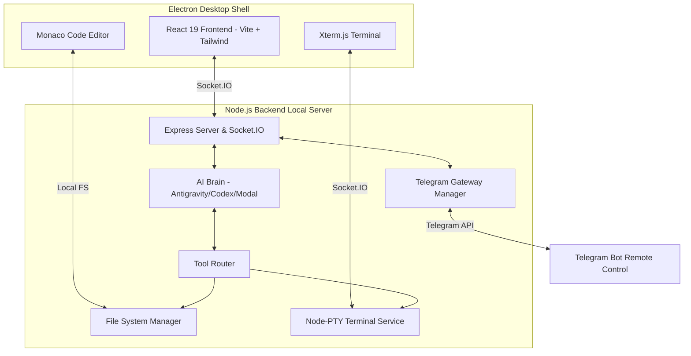

<div align="center">

  <!-- Animated Logo/Header -->
  
  
  # <span style="background: linear-gradient(135deg, #10b981 0%, #06b6d4 100%); -webkit-background-clip: text; -webkit-text-fill-color: transparent;">DevStudio AI</span>
  
  ### *The Agentic, Liquid-Glass IDE That Codes With You, Not Just For You*
  
  <!-- Animated Badges -->
  <p>
    
    
    
  </p>
  
  <!-- Tech Stack Badges -->
  <p>
    
    
    
    
    
  </p>

  <!-- Quick Action Buttons -->
  <p>
    <a href="#-quick-start">
      
    </a>
    <a href="#-architecture">
      
    </a>
    <a href="#-telegram-gateway">
      
    </a>
  </p>

</div>

---

## 🎬 What Makes It Different?

> **"It's not just an editor. It's an autonomous coding companion wrapper that integrates multi-provider AI agents, offers a macOS-inspired liquid glassmorphism interface, and keeps you remotely connected via a secure Telegram Gateway."**

<div align="center">

| 🧠 **Autonomous Agentic Brain** | 📂 **VS Code Architected Tree** | 📱 **Remote Control Gateway** |
|:---:|:---:|:---:|
| Dual Google & OpenAI OAuth | Zero-latency inline SVGs | Remote command triggering |
| Multi-step reasoning loops | Virtualized node tree (10K+ files) | Real-time status reporting |
| Safe operation confirmation guard | Portal-based context menus | Mobile-friendly workspace monitoring |

</div>

---

## ✨ Core Capabilities

### 🤖 Multi-Provider Agentic AI Engine
* **Double OAuth PKCE Flows:** Completely isolated authentication paths for Google Antigravity & OpenAI Codex.
* **Flexible Providers:** Run with Google Cloud Gemini, OpenAI Codex, or custom Modal GLM endpoints.
* **Autonomous Task Loop:** Multi-step thinking loop allowing the agent to read, write, execute terminal commands, and verify changes iteratively.
* **Summon Agent Anywhere:** Instantly open the AI session panel using <kbd>Ctrl</kbd> + <kbd>I</kbd>.
* **Confirm Before Destructive Action:** High-safety confirmation guards for file deletions or system commands.

### 🎨 Premium Liquid Glassmorphism UI
* **macOS-inspired Panels:** Blurry transparent sidebars, glowing acrylic accents, and smooth transition animations.
* **Custom Theme Manager:** Tailor the IDE background and text themes dynamically.
* **Rich Activity Dashboard:** Visual phase indicators showing the AI's internal process (THINKING ➔ READING ➔ WRITING ➔ EXECUTING ➔ VERIFYING ➔ DONE).

### 📁 Advanced File Explorer
* **Zero-Latency SVG Icons:** Material Icon style paths drawn synchronously on first paint—no dynamic imports or latency.
* **Visual Indent Guides:** Tree branch guidelines for deep directory nested files.
* **Portal-Based Context Menu:** Rendered directly into the document body to prevent clipping or instant-disappearing bugs.
* **CSS-Only Hover System:** Eliminates unnecessary React re-renders on mousemove.
* **Non-Blocking Git Badges:** Real-time modified (`M`), added (`A`), and untracked (`U`) badges without blocking the main event loop.

### 💻 Developer Experience
* **Monaco Editor Wrapper:** Core VS Code editor with full syntax highlighting, tabs, breadcrumbs, search, and diagnostics.
* **Real PTY Terminals:** Xterm.js terminal sheets backed by a real Node-pty backend wrapper.
* **Chokidar File Watching:** Real-time hot module replacement and folder updates.

---

## 🏗️ System Architecture



---

## ⚡ Quick Start

### Prerequisites
* **Node.js v22+**
* **Git**
* **4GB RAM minimum**

### 1. Installation
Clone the repository and install dependencies for both the frontend and backend workspace:

```powershell
# Clone the repository
git clone https://github.com/yadavnithi887-hue/v0.5.git
cd v0.5

# Install root dependencies
npm install

# Install backend dependencies
cd backend
npm install
cd ..
```

### 2. Run the Application
Start the frontend, backend server, and Electron shell simultaneously using the concurrent runner:

```powershell
npm run start:full
```

---

## 🔐 AI Brain Authentication

### Google Antigravity OAuth
1. Open the Settings panel inside the IDE (<kbd>Ctrl/Cmd</kbd> + <kbd>,</kbd>).
2. Click **"Connect Google Account"**.
3. Authenticate in the browser page on the local callback port (default `51121`).
4. The IDE will automatically discover your GCP `projectId`.

### OpenAI Codex OAuth
1. Open the Settings panel inside the IDE.
2. Click **"Connect OpenAI Codex"**.
3. Authenticate in the browser via OpenAI's OAuth endpoint.
4. The callback automatically completes using `http://localhost:1455/auth/callback`. If blocked, copy and paste the redirect URL manually into the setup panel.

---

## 📱 Telegram Gateway Setup

You can remote control your AI tasks and monitor long builds directly from your mobile phone.

| Step | Action | Description / Command |
| :--- | :--- | :--- |
| **1** | **Create Bot** | Message `@BotFather` on Telegram and type `/newbot`. |
| **2** | **Get Token** | Copy the API token provided by `@BotFather`. |
| **3** | **Get Chat ID** | Message `@userinfobot` to retrieve your account's unique Chat ID. |
| **4** | **Configure** | Navigate to DevStudio Settings and paste the Token & Chat ID. |
| **5** | **Activate** | Click **"Start Gateway"** 🚀 inside the dashboard to link the bot. |

> 💡 **Pro Tip**: Ask your agent to write a script or build your app. Go grab a coffee, and get notified on Telegram the moment it completes the job!

---

## 🗺️ Project Roadmap

- [x] **v0.5.0** - Core IDE shell + initial AI tools + basic Telegram notifications.
- [x] **v1.2.0** - Multi-provider isolated OAuth (Google & OpenAI Codex), Virtualized file explorer, macOS liquid glassmorphism.
- [ ] **v1.3.0** - Local SQLite Database integration for unlimited persistent session history.
- [ ] **v1.4.0** - Monaco built-in side-by-side diff viewer.
- [ ] **v2.0.0** - Live collaborative share & voice control integration.

---

## 🤝 Contributing

We love contributions! Follow these steps to submit a feature:

1. **Fork** the project repository.
2. Create your feature branch (`git checkout -b feature/amazing-feature`).
3. Commit your changes (`git commit -m '✨ Add amazing feature'`).
4. Push to the branch (`git push origin feature/amazing-feature`).
5. Open a **Pull Request** on GitHub.

---

## 📄 License

Distributed under the MIT License. See `LICENSE` for details.

<div align="center">

🌟 **Star our repository on GitHub if you love what we are building!**

Made with ❤️ by the DevStudio Team

[X.com](https://x.com/NitishYadav1947) | [E-mail](mailto:nitishyadav2976@gmail.com)

</div>
